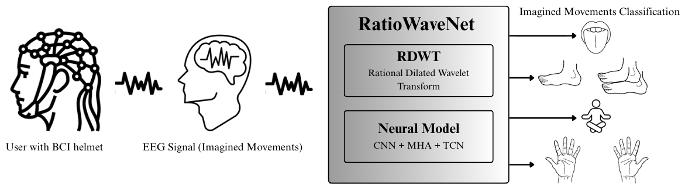
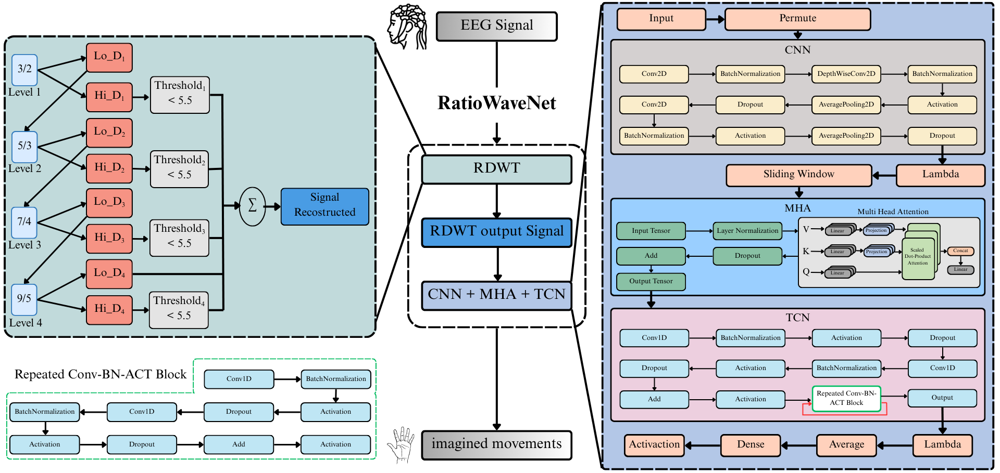

# RatioWaveNet

	

RatioWaveNet is a custom deep learning architecture designed for the classification of EEG signals in Motor Imagery (MI) tasks. Inspired by existing models like EEGNet and ATCNet, RatioWaveNet introduces a lightweight CNN framework enhanced with residual connections, dropout, and optimized temporal feature extraction. 

## Publication

The RatioWaveNet study has been published in **Array**.
The final version of the article is available on ScienceDirect via the following DOI:

https://doi.org/10.1016/j.array.2026.100961

Authors : Giuseppe Bonomo, Marco Siino, Rosario Sorbello

University of Palermo, Italia 

---
In addition to the proposed [**RatioWaveNet**](https://github.com/Bonomo31/RatioWaveNet) model, the repository includes implementations of several other well-known EEG classification architectures in the `models.py` file, which can be used as baselines for comparison with RatioWaveNet. These include:

- **ATCNet**:[paper](https://ieeexplore.ieee.org/document/9852687), [original code](https://github.com/Altaheri/EEG-ATCNet)
- **EEGNet**:[paper](https://arxiv.org/abs/1611.08024), [original code](https://github.com/vlawhern/arl-eegmodels)
- **EEG-TCNet**:[paper](https://arxiv.org/abs/2006.00622), [original code](https://github.com/iis-eth-zurich/eeg-tcnet)
- **MBEEG_SENet**:[paper](https://www.mdpi.com/2075-4418/12/4/995)
- **ShallowConvNet**:[paper](https://onlinelibrary.wiley.com/doi/full/10.1002/hbm.23730), [original code](https://github.com/braindecode/braindecode)

The following table summarizes the classification performance of [**RatioWaveNet**](https://github.com/Bonomo31/RatioWaveNet) and the other reproduced models, based on the experimental setup defined in the notebook for each model and dataset.

| Model           | #params | BCI 4-2a Accuracy | BCI 4-2a Kappa | BCI 4-2b Accuracy | BCI 4-2b Kappa | HGD Accuracy | HGD Kappa |
|-----------------|---------|-------------------|----------------|-------------------|----------------|--------------|-----------|
| RatioWaveNet        | 113,732 | 82.14             | 76.20          | 97.69             | 80.60          | 92.81        | 90.40     |
| ATCNet          | 113,732 | 81.10             | 79.73          | 89.41             | 78.80          | 92.05        | 89.40     |
| EEGTCNet        | 4,096   | 77.97             | 70.63          | 83.69             | 67.31          | 87.80        | 83.73     |
| MBEEG_SENet     | 10,170  | 79.98             | 73.30          | 86.53             | 73.02          | 90.13        | 86.84     |
| ShallowConvNet  | 47,310  | 80.52             | 74.02          | 86.02             | 72.38          | 87.00        | 82.67     |
| EEGNet          | 2,548   | 77.68             | 70.24          | 86.08             | 72.13          | 88.25        | 84.33     |

### **Disclaimer**   
> - The results reported for **BCI 4-2a**, **BCI 4-2b** and **HGD** datasets were not recomputed by us and are directly extracted from the original papers.  
> - **HGD (High Gamma Dataset)**: Refers to physically executed movements (executed movements), not motor imagery (motor imagery).

----
# Comparative preprocessing  

The following table presents a comparative analysis of different deep learning models with and without the application of the RDWT (Rational Dilated Wavelet Transform) preprocessing technique. The evaluation covers three benchmark EEG motor imagery datasets: BCI Competition IV-2a, BCI Competition IV-2b, and the High-Gamma Dataset (HGD). The aim is to assess the impact of RDWT on classification performance (accuracy and Cohen’s kappa score).

In particular, the results highlight the performance improvements achieved by [**RatioWaveNet**](https://github.com/Bonomo31/RatioWaveNet) when combined with the RDWT preprocessing, compared to both its baseline (no preprocessing) and other well-established architectures.

| Model           | Preprocessing | BCI 2a Acc. | BCI 2a κ | BCI 2b Acc. | BCI 2b κ | HGD Acc. | HGD κ |
|----------------|---------------|-------------|----------|-------------|----------|----------|--------|
| RatioWaveNet       | None          | 79.36       | 72.50    | 97.00       | 69.80    | 87.45    | 83.30  |
|                | RDWT          | 82.14       | 76.20    | 97.69       | 80.60    | 92.81    | 90.40  |
| ATCNet         | None          | 79.71       | 72.90    | 96.90       | 63.30    | 88.88    | 85.20  |
|                | RDWT          | 79.51       | 72.70    | 96.74       | 61.90    | 88.26    | 84.30  |
| EEGTCNet       | None          | 64.35       | 52.50    | 95.81       | 58.90    | 86.60    | 82.10  |
|                | RDWT          | 68.79       | 58.40    | 96.09       | 66.60    | 87.14    | 82.90  |
| MBEEG_SENet    | None          | 70.49       | 60.60    | 96.95       | 73.80    | 90.58    | 87.40  |
|                | RDWT          | 72.72       | 63.60    | 96.28       | 63.50    | 90.26    | 87.00  |         
| ShallowConvNet | None          | 65.74       | 54.30    | 96.13       | 60.70    | 87.05    | 82.70  |
|                | RDWT          | 66.32       | 55.10    | 95.94       | 62.30    | 87.27    | 87.27  |
| EEGNet         | None          | 70.79       | 61.10    | 95.85       | 59.60    | 87.32    | 83.10  |
|                | RDWT          | 70.10       | 60.10    | 96.06       | 64.00    | 88.08    | 84.10  |

### **Note**   
> - The recomputed results for these datasets (including accuracy/kappa scores) are available in their respective dataset folders.  
> - *Unlike the previous table, the results reported here for the HGD and BCI IV-2b datasets include an enhanced preprocessing pipeline, which incorporates data augmentation and class balancing techniques. These strategies were employed to address class imbalance and improve the generalization capabilities of the models.*
> - These values were obtained using our implementation and preprocessing pipeline. Minor deviations from the original papers are expected.

----

## Multi-seed robustness (multiple runs) — RatioWaveNet vs ATCNet

To assess robustness to training stochasticity (i.e., to ensure that the observed improvements are not driven by a favorable initialization), we evaluate **RatioWaveNet** and **ATCNet** across multiple independent random seeds on three benchmarks: **BCI Competition IV-2a**, **BCI Competition IV-2b**, and the **High-Gamma Dataset (HGD)**.  
We report subject-wise test accuracy (\%) for each run, together with **Avg Acc** (mean accuracy across subjects) and **Avg κ** (mean Cohen’s κ across subjects). The final **Mean** row summarizes results across runs (5 seeds for BCI IV-2a and IV-2b; 3 seeds for HGD).

### BCI IV-2a — Detailed test accuracy across 5 seeds

| Model | Seed | S1 | S2 | S3 | S4 | S5 | S6 | S7 | S8 | S9 | Avg Acc | Avg κ |
|------|------|----|----|----|----|----|----|----|----|----|---------|-------|
| **RatioWaveNet** | 1 | 86.46 | 68.75 | 93.06 | 84.03 | 74.65 | 70.83 | 92.01 | 80.21 | 89.24 | 82.14 | 0.762 |
|  | 2 | 86.11 | 62.85 | 92.36 | 82.29 | 71.18 | 69.44 | 93.75 | 81.25 | 87.50 | 80.75 | 0.743 |
|  | 3 | 85.76 | 67.71 | 91.32 | 83.33 | 64.93 | 69.44 | 86.81 | 79.86 | 85.42 | 79.40 | 0.725 |
|  | 4 | 82.64 | 67.01 | 94.44 | 84.03 | 69.79 | 70.49 | 90.28 | 77.08 | 86.46 | 80.25 | 0.737 |
|  | 5 | 85.42 | 63.19 | 89.93 | 76.39 | 71.53 | 76.04 | 91.32 | 79.86 | 89.93 | 80.40 | 0.739 |
|  | **Mean** | 85.28 | 65.90 | 92.22 | 82.01 | 70.42 | 71.25 | 90.83 | 79.65 | 87.71 | **80.59** | **0.741** |
| ATCNet | 1 | 86.46 | 70.49 | 92.71 | 78.12 | 71.88 | 66.67 | 92.36 | 77.08 | 87.15 | 80.32 | 0.738 |
|  | 2 | 85.76 | 65.97 | 93.06 | 84.72 | 72.22 | 67.36 | 90.28 | 75.35 | 86.81 | 80.17 | 0.736 |
|  | 3 | 85.42 | 67.01 | 94.10 | 76.04 | 71.53 | 70.14 | 91.67 | 76.74 | 87.15 | 79.98 | 0.733 |
|  | 4 | 85.42 | 63.19 | 89.58 | 77.43 | 64.93 | 70.83 | 93.06 | 79.51 | 90.97 | 79.44 | 0.726 |
|  | 5 | 86.11 | 63.54 | 88.54 | 80.21 | 71.53 | 68.06 | 93.06 | 80.21 | 86.11 | 79.71 | 0.729 |
|  | Mean | 85.83 | 66.04 | 91.60 | 79.30 | 70.42 | 68.61 | 92.70 | 77.78 | 87.64 | 79.92 | 0.732 |

### BCI IV-2b — Detailed test accuracy across 5 seeds

| Model | Seed | S1 | S2 | S3 | S4 | S5 | S6 | S7 | S8 | S9 | Avg Acc | Avg κ |
|------|------|----|----|----|----|----|----|----|----|----|---------|-------|
| **RatioWaveNet** | 1 | 98.94 | 99.10 | 97.46 | 91.11 | 92.31 | 100.00 | 98.89 | 99.28 | 99.13 | 97.36 | 0.656 |
|  | 2 | 98.94 | 97.30 | 98.91 | 97.78 | 91.67 | 99.53 | 98.52 | 99.64 | 99.13 | 97.93 | 0.732 |
|  | 3 | 98.94 | 98.20 | 98.91 | 91.11 | 92.95 | 100.00 | 98.15 | 98.19 | 99.13 | 97.29 | 0.665 |
|  | 4 | 98.94 | 98.20 | 97.83 | 88.89 | 93.59 | 100.00 | 98.89 | 99.28 | 98.70 | 97.14 | 0.617 |
|  | 5 | 98.94 | 98.20 | 98.19 | 88.89 | 91.03 | 100.00 | 98.15 | 99.64 | 99.57 | 96.95 | 0.649 |
|  | **Mean**  | 98.94 | 98.20 | 98.26 | 91.56 | 92.31 | 99.81 | 98.52 | 99.21 | 99.13 | **97.34** | **0.664** |
| ATCNet | 1 | 100.00 | 98.20 | 99.28 | 82.22 | 92.31 | 100.00 | 98.89 | 98.55 | 98.70 | 96.46 | 0.676 |
|  | 2 | 98.94 | 98.20 | 99.64 | 86.67 | 91.67 | 99.53 | 97.78 | 98.55 | 97.40 | 96.49 | 0.569 |
|  | 3 | 98.94 | 97.30 | 98.91 | 86.67 | 94.23 | 99.06 | 100.00 | 99.28 | 96.10 | 96.72 | 0.631 |
|  | 4 | 98.23 | 99.10 | 98.19 | 86.67 | 90.38 | 99.53 | 96.30 | 98.91 | 98.27 | 96.17 | 0.521 |
|  | 5 | 99.29 | 98.20 | 98.91 | 86.67 | 92.31 | 100.00 | 96.67 | 98.91 | 99.57 | 96.72 | 0.637 |
|  | Mean | 99.08 | 98.20 | 98.99 | 85.78 | 92.18 | 99.62 | 97.93 | 98.84 | 97.81 | 96.51 | 0.607 |

> Takeaway (2b): The task is near-ceiling for both methods, but RatioWaveNet maintains a consistent edge in Avg Acc and, more importantly, a higher Avg κ, which is informative under saturation.

### HGD — Detailed test accuracy across 3 seeds

| Model | Seed | S01 | S02 | S03 | S04 | S05 | S06 | S07 | S08 | S09 | S10 | S11 | S12 | S13 | S14 | Avg Acc | Avg κ |
|------|------|-----|-----|-----|-----|-----|-----|-----|-----|-----|-----|-----|-----|-----|-----|---------|-------|
| **RatioWaveNet** | 1 | 87.50 | 92.50 | 98.12 | 97.50 | 92.50 | 95.00 | 91.82 | 90.00 | 93.75 | 88.12 | 85.00 | 90.62 | 89.38 | 79.38 | 90.80 | 0.877 |
|  | 2 | 86.88 | 95.62 | 98.12 | 98.12 | 93.12 | 90.00 | 89.31 | 91.88 | 95.00 | 90.00 | 80.62 | 94.38 | 89.38 | 76.88 | 90.66 | 0.876 |
|  | 3 | 90.62 | 90.00 | 98.75 | 97.50 | 95.00 | 92.50 | 91.19 | 91.25 | 95.00 | 93.75 | 81.88 | 90.62 | 89.38 | 71.88 | 90.67 | 0.876 |
|  | **Mean** | **88.33** | **92.71** | **98.33** | **97.71** | **93.54** | **92.50** | **90.77** | **91.04** | **94.58** | **90.62** | **82.50** | **91.87** | **89.38** | **76.71** | **90.71** | **0.876** |
| ATCNet | 1 | 85.00 | 85.62 | 96.25 | 98.12 | 88.12 | 92.50 | 92.45 | 86.25 | 91.25 | 89.38 | 75.62 | 88.75 | 90.62 | 78.12 | 88.43 | 0.846 |
|  | 2 | 82.50 | 86.25 | 95.00 | 96.25 | 86.25 | 93.75 | 88.05 | 92.50 | 95.00 | 86.25 | 75.00 | 91.25 | 93.12 | 76.88 | 88.43 | 0.846 |
|  | 3 | 83.75 | 87.50 | 96.88 | 97.50 | 88.75 | 94.38 | 90.57 | 88.12 | 89.38 | 88.75 | 78.75 | 89.38 | 85.00 | 68.12 | 87.63 | 0.835 |
|  | Mean | 83.75 | 86.46 | 96.04 | 97.29 | 87.71 | 93.54 | 90.36 | 88.96 | 91.21 | 88.13 | 76.46 | 89.79 | 89.58 | 74.37 | 88.17 | 0.842 |

### **Note**  
> Multi-seed reporting is particularly relevant in EEG decoding, where outcomes can vary due to stochastic training (initialization, mini-batch ordering, etc.). These tables are meant as a transparency/reproducibility check, aligned with the experimental protocol discussed in the paper.

**Reproducibility note.**
All RatioWaveNet results are obtained using the implementation released in this repository.
ATCNet results are recomputed using the official ATCNet repository, without modifying the original architecture. For both models, we adopt the same data split, preprocessing pipeline, and evaluation protocol. Each run differs only by the random seed (affecting weight initialization and training stochasticity), ensuring a fair and reproducible comparison.

----

# None vs STFT vs RDWT in RatioWaveNet

| Dataset                  | Preprocessing | Accuracy (%) | Kappa (κ) |
|--------------------------|---------------|--------------|-----------|
| **BCI Competition IV-2a**| None          | 79.36        | 72.50     |
|                          | STFT          | 79.09        | 72.10     |
|                          | RDWT          | 82.14        | 76.20     |
| **BCI Competition IV-2b**| None          | 97.00        | 69.80     |
|                          | STFT          | 97.23        | 67.60     |
|                          | RDWT          | 97.69        | 80.60     |
| **High-Gamma Dataset**   | None          | 87.45        | 83.30     |
|                          | STFT          | 88.57        | 84.80     |
|                          | RDWT          | 92.81        | 90.40     |

---

# About RatioWaveNet

---

# Dataset

This project uses three publicly available EEG motor imagery datasets for training and evaluation:

### 1. BCI Competition IV – Dataset 2a

- **Description**: EEG data from 9 subjects performing four different motor imagery tasks: left hand, right hand, feet, and tongue movements. Each subject completed two sessions (training and evaluation), with 288 trials per session.
- **Format**: `.mat` files
- **Download**: [BCI Competition IV – Dataset 2a](https://bnci-horizon-2020.eu/database/data-sets/001-2014/)

### 2. BCI Competition IV – Dataset 2b

- **Description**: EEG recordings from 9 subjects performing left and right hand motor imagery tasks. The dataset contains five sessions per subject, with three sessions including feedback.
- **Format**: `.gdf` files
- **Download**: [BCI Competition IV – Dataset 2b](https://www.bbci.de/competition/iv/download/)

### 3. High-Gamma Dataset (HGD)

- **Description**: EEG recordings from 14 subjects performing motor execution tasks, recorded using 128 channels. This dataset is well-suited for high-frequency EEG analysis.
- **Format**: `.mat` files
- **Download**: Available through the [GIN Repository](https://web.gin.g-node.org/robintibor/high-gamma-dataset)

> **Note**: Each dataset has a dedicated notebook in this repository, which includes download links and preprocessing instructions.

